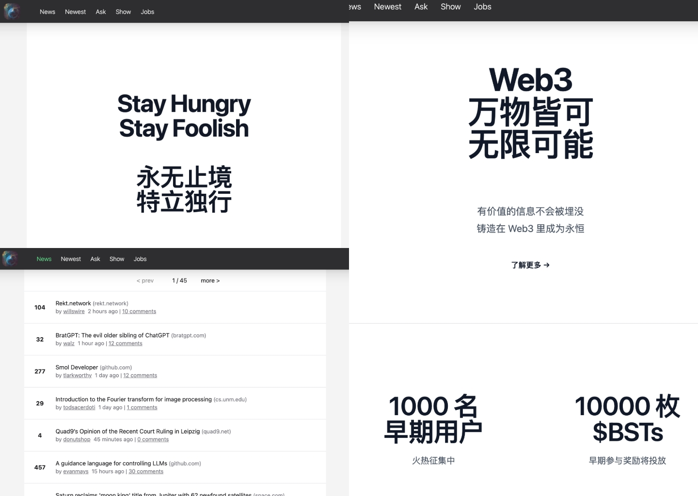

## Web3Hacker News

Web3Hacker.News 项目立足于构建 Web3 版本的 Hacker News(https://news.ycombinator.com/) 的思路下创建的。

将基于现有的 HackerNews 功能（目前完成自动同步 Hacker News数据功能）基础上， 结合 BuidlerProtocol 提供的创作者经济协议，来构建 Web3 版本的 Hacker News。

使得信息分发更加有效率、效益及公平。

<h2 align="center">
Web3 Blog Platform for Web3
</h2> 

<pre align="center">
🧪 Working in Progress
</pre>

 
<a href="https://web3hacker.news/">Online Preview</a>
  

## Features

目前已经实现：基于 NuxtJs 框架实现了自动同步 Hacker News 数据功能

接下来逐步实现：

1. 可以独立于 Hacker News 数据源，在 Web3Hacker.News 上就可以新建分享的信息源
2. 每个 news 条目可以新建一个 NFT，并实现点赞即 Mint NFT 功能，使得最早的分享者可以获得一定的收益
3. 用户可以在每个 news 条目下评论，而评论也可以被创建为新的 NFT，并支持点赞即 Mint NFT，这样有助于优质的评论观点得到奖励及放大
4. 实现NFT付费阅读功能，使得用户分享的信息的同时可以附带对信息的有深度的评论解析，而读者可以通过 mint NFT 来支付费用给解析提供者，只有成功 mint NFT 者可以解锁付费内容（链上验证模式）
5. 集成Web3MQ SDK，使得用户可以随时和正在浏览相同的帖子其他用户实时交流

## Tech

- [IPFS] 用户去中心化存储
- [EthersJS] 链接 Metamask，调用 Web3 的接口等
- [💚 Nuxt 3](https://nuxt.com/) - SSR, ESR, File-based routing, components auto importing, modules, etc.

- ⚡️ Vite - Instant HMR.

- 🎨 [UnoCSS](https://github.com/antfu/unocss) - The instant on-demand atomic CSS engine.

- 😃 Use icons from any icon sets in Pure CSS, powered by [UnoCSS](https://github.com/antfu/unocss).

- 🔥 The `<script setup>` syntax.

- 🍍 [State Management via Pinia](https://pinia.esm.dev), see [./composables/user.ts](./composables/user.ts).

- 📑 [Layout system](./layouts).

- 📥 APIs auto importing - for Composition API, VueUse and custom composables.

- 🏎 Zero-config cloud functions and deploy.

- 🦾 TypeScript, of course.

- 📲 [PWA](https://github.com/vite-pwa/nuxt) with offline support and auto update behavior.
